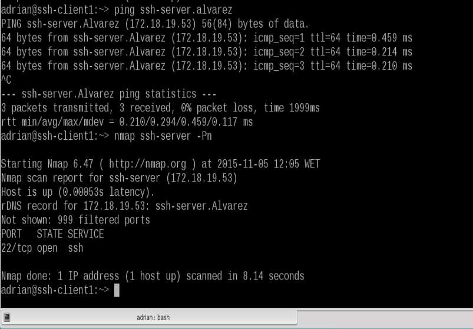

Gregorio AdriÁn Quintero Álvarez

#Acceso Remoto de SHH

## 0.1 Introducción

En esta práctica lo que vamos a realizar es una conexión remota mediante shh y
para ello es necesario la instalación del servicio shh y estas tres máquinas:
- Un servidor OpenSUSE con una ip estatica la cual será 172.18.19.53.
- Un cliente OpenSUSE con un ip estatica la cual será 172.18.19.54.
- Un cliente Windows 7 con ip estatica y que será 172.18.19.13.

## 0.2 Configuración de red

Ahora nos dispondremos a realizar la configuración de las redes de las máquinas
estableciendolas es estático y para realizar esta modificación usaremos el entorno
gráfico que nos proporciona OpenSUSe que es yast.

Tambien vamos a realizar dicha configuración en windows 7.

# 1 Preparativos

## 1.1 Servidor SSH

Vamos a empezar configurando la máquina de OpenSUSE estableciendole los siguiente
valores:
- Como nombre de usuario pondremos nuestro nombre
- Como clave para root usaremos nuestro DNi
- Para nombre del equipo usaremos ssh-server
- Como nombre del dominio estableceremos el segundo apellido

Ahora iremos a la la extensión /etc/ y editaremos el archivo hosts y le añadiremos
los datos del cliente y de windows, ambos los configuraremos a continuación.

Después para comprobar que los cambios se han realizado ejecutarmos una serie de
comandos, los cuales son los que vemos en la imagen que se muestra a continuación:

Ahora crearemos 4 usuarios a los cuales le pondremos de nombre el primer apellido
y le añadiremos un número del 1-4.

## 1.2 Cliente OpenSUSE

En el cliente de OpenSUSE estableceremos como nombre de usuario nuestro nombre,
como contraseña de root nuestro DNi y como nombre del equipo ssh-client1 y le 
pondremos el mismo dominio que al servidor nuestro segundo apellido, después 
modificaremos el archivo /etc/hosts y le añadiremos el servidor y el cliente de windows.

## 1.3 Cliente Wondows 7

En esta máquina instalaremos el cliente ssh para ello descargaremos un programa
llamado PuTTY y lo ejecutamos.

Despues configuraremos el windows estableciendo como nombre de usuario nuestro nombre
y como clave de administrador nuestro DNi, también le cambiaremos el nombre del
equipo y ponemos ssh-client2-19 y por último modificaremos el archivo hosts
situado en C:\Windows\System32\drivers\etc\ y le añadiremos el equipo 
ssh-server y ssh-client1.

 

# 2 Instalación del servicio SSH

Estando en nuestro servidor iremos a un terminal y ejecutaremos el comando zypper in openssh
el cual nos instalara el servicio ssh si no lo tenemos instalado, en cambio si el servicio ya se encuentra en nuestro equipo nos dira que ya esta 
instalado y nos dira que versión tenemos.

## 2.1 Comprobación 

Desde nuestro servidor ejecutaremos el comando "systemctl status sshd" para ver en que estado se encuentra nuestro servicio el cual aparece desabilitado y sin ejecutar

 
para cambiar eso ejecutaremos estos dos comandos:

- systemctl enable sshd para pones en servicio en enable 
- systemctl start sshd para poner en ejecución el servicio shh

Despues comprobaremos que nuestro servicio esta escuchando por el puesto 22 usando el comando "netstat -ntap"

## 2.2 Primera conexión SSH desde el cliente

Empezaremos comprobando que desde nuestro cliente hay conexión con nuestro servidor para ello 
haremos un ping al ssh-server y después comprobaremos que el servidor tiene el puerto 22 abirto 
usando el comando nmap ssh-server desde el cliente.

Puesto que nuestra conexión fallo la primera vez nos vamos al cortafuegos y en
servicios autorizados pondremos el SSH en una zona externa.

asi nos permita la conexión entre ambos y tambien configuraremos la interfaces.

Después realizaremos el ping ssh-server y  nmap ssh-serve y comprobamos que nos sale la escucha del puerto 22.

Ahora desde el cliente nos vamos a conectar al usuario quintero1 que se encuentra en el servidor
para ello pondremos ssh quintero1@ssh-server.Alvarez. Durante esta conexión se intercambiaran las claves
que se producen en la primera conexión SSH.

A continuación saldremos y nos volveremos a conectar y vemos que ahora no nos sale el intercambio de claves
solo nos pide nuestra contraseña y se realiza la conexión.

Ahora cerraremos la conexión entre ambos y desde nuestro cliente comprobaremos el archivo 
known_hosts que se encuentra en nuestro home para ello usamos el comando ll .ssh/ 

Una vez llegado a este punto probamos la conexion con windows puesto que la configuración
esta realizada correctamente tambien nos debería dejar entrar sin problemas.

## 2.3 Cambiar la clave en el servidor

Lo que vamos a realizar primero sera que existen los ficheros en /etc/ssh para ello
usaremos el comando "ll" desde el servidor

Después modificaremos la configuracion de ssh (/etc/ssh/shhd_config) para dejar una linea
que definirá las claves que van a identificar nuestro servidor.

Mediante otro comando generaremos las nuevas claves de SSH para ello es necesario ser root

Ahora reiniciamos el servicio SSH para que los cambios se aplique y lo comprobamos

Para comprobar que el cambio se ha realizado intentamos entrar con los usuarios de quintero1 y quintero2
desde los dos clientes tanto desde client1 como de client2.

-Client1

-Client2 

Para restablecer la entrada de usuarios y que no nos de problemas usamos el comando
que no pedia y asi restablecer las nues claves del servidor en el cliente.

# 3 Personalización del prompt Bash

A continuación vamos a realizar la configuracion del .bashrc para que la apariencia 
cuando entremos en los clientes cambie y aparezca de otra forma. Para ello vamos 
a ir al home del usuario que queremos personalizar y configuramos el .bashrc. Ademas
tambien crearemos el archivo .alias con accesos rapidos

# 4 Autenticacion mediante claves públicas

En este apartado vamos a configurar SSH para poder acceder desde el cliente1,
usando quintero4 sin poner password

Vamos a configurar la autenticación mediante clave pública para acceder con nuestro
usuario personal desde el equipo cliente al servidor con el usuario 1er-apellido-alumno4.

- Iniciamos sesión con nuestro usuario nombre-alumno de la máquina ssh-client1.

- Ejecutamos ssh-keygen -t rsa para generar un nuevo par de claves para el usuario en /home/nuestro-usuario/.ssh/id_rsa y /home/nuestro-usuario/.ssh/id_rsa.pub.

- Ahora vamos a copiar la clave pública (id_rsa.pub) del usuario (nombre-de-alumno)de la máquina cliente, al fichero "authorized_keys" del usuario remoteuser4 en el servidor. Hay dos formas de hacerlo:
Modo 1. Usando un comando específico para ello ssh-copy-id remoteuser4@ssh-server

- Comprobar que ahora podremos acceder remotamente, sin escribir el password desde el cliente1.

- Comprobar que al acceder desde cliente2, si nos pide el password.

# 5 Uso de SSh como túnel para X

Desde nuestro servidor instalamos una aplicación de entorno gráfico como el geany,
en el caso de que esta aplicación estuviese instalada en los clientes tendriamos que quitarlas.

Posteriormente modificaremos el servidor ssh para que permita la ejecución de aplicaciones
gráficas desde los clientes

Ahora comprobaremos que desde nuestro cliente nos permite utilizarlo para ello hay que
entrar de forma remota para ello usamos ssh -X quintero1@ssh-server.alvarez

# 6 Aplicaciones Windows nativas

Usando un emulador en el servidor podemos acceder desde OpenSUSE a aplicaciones de 
windows.

Para ello instalamos el emulador Wine

Después podremos usar la aplicación notepad que se instala por defecto al instalar el Wine y
para ver que esto funciona ponemos en el servidor notepad

Ahora hacemos la misma comprobación desde client1 para ello es necesario entrar de forma remota

# 7 Restricciones de uso

## 7.1 Sin Restricción

Al usuario 1 no se le aplicaran restricciones podra acceder libremente

## 7.2 Restricción total

En el servidor SSH le aplicaremos la restricción al usuario2  para que no tenga acceso
mientra que los demas podrán acceder libremente.

Para ello configuramos el /etc/ssh/shhd_config estableciento unas lineas al final

Ahora comprobaremos el acceso desde ambos clientes

- Client1 

- Client2

## 7.4 Restricciones sobre aplicaciones

Ahora vamos a crear una restricción de permisos sobre determinadas aplicaciones.

- Usaremos el usuario remoteuser4
- Crear grupo remoteapps
- Incluir al usuario en el grupo.

- Localizar el programa APP1. Posiblemente tenga permisos 755.
- Poner al programa APP1 el grupo propietario a remoteapps

- Poner los permisos del ejecutable de APP1 a 750. Para impedir que los que no pertenezcan al grupo puedan ejecutar el programa.

- Comprobamos el funcionamiento en el servidor.

- Comprobamos el funcionamiento desde el cliente.

