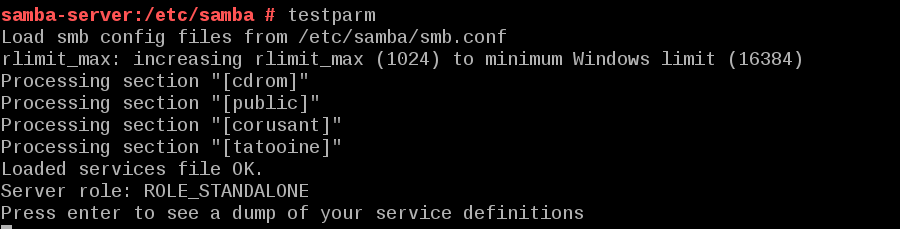

Gregorio Adrián Quintero Álvarez

# 1 Samba - OpenSUSE

## 1.0 Introducción

En esta práctica vamos a necesitar tres máquinas virtuales, un servidor que será 
OpenSUSE y dos clientes que serán uno OpenSUSE y otro Windows 7. Estas máquinas t
tendrán que estar en estatico con esta configuración: 

- Servidor OpenSUSE 172.18.19.53
- Cliente OpenSUSE 172.18.19.54
- Cliente Windows 172.18.19.13

## 1.1 Preparativos

Ahora configuraremos las máquinas estableciendo en ellas como nombre de usuario
nuestro nombre y como clave de root en OpenSUSE y administrador de Windows nuestro
DNi.

En el servidor pondremos como nombre de equipo "Samba-server" y como 
nombre de dominio nuestro segundo apellido "Alvarez".

 

En el cliente OpenSUSE pondremos como nombre de equipo "Samba-cli1" y como nombre de dominio
nuestro segundo apellido "Alvarez".

En el cliente Windows 7 como nombre de equipo pondremos "Samba-cli2-19".

También deberemos de añadir nuestra comfiguración al archivo hosts de nuestras máquinas.

- Servidor.

- Cliente OpenSUSE.

- Cliente Windows.

Ahora debemos de realizar una comprobación en el servidor con estos comandos:

hostname -f, ip a, lsblk, sudo blkid.

## 1.2 Usuarios Locales

En el servidor vamos a crear unos usuarios y unos grupos.

- Primero crearemos los usuarios "Jedi1, jedi2, sith1, sith2, supersamba".

Después crearemos el grupo "jedis" y "siths" en el cual meteremos los usuarios.

- Grupo Jedis

-Grupo Siths

Ahora crearemos el usuario "smbguest" y nos aseguramos de que nadie pueda entrar
a nuestra máquina mediante el login para eso modificamos el fichero /etc/passwd.

A continuación crearemos un grupo llamado "startwars" y dentro de el introduciremos
todos los usuarios que hemos creado anteriormente

## 1.3 Instalar Samba

Empezaremos con las instalación de samba mediante comando

## 1.4 Crear las carpetas para los recursos compartidos

Ahora vamos a crear las carpetas de los recursos compartidos  public.d corusant.d y tatooine con una serie de permisos:

## 1.5 Configurar Samba

A continuación vamos a hacer una copia de seguridad del fichero de configuración con el comando:

- cp /etc/samba/smb.conf /etc/samba/smb.conf.000.

Después vamos a configurar el servidor Samba con las siguientes opciones.

Comprobaremos los resultados  que todo está bien con testparm.

## 1.6 Usuarios Samba

Después de crear los usuarios en el sistema, hay que añadirlos a Samba. Para eso
hay que usar el comando siguiente para cada usuario de Samba: smbpasswd -a nombreusuario.

Al terminar comprobamos nuestra lista de usuarios Samba con el comando: pdbedit -L

## 1.7 Reiniciar

Ahora que hemos terminado con el servidor, hay que reiniciar el servicio para
que se lean los cambios de configuración para ello usamos estos comandos:

- systemctl stop smb, systemctl start smb, systemctl status smb

- systemctl stop nmb, systemctl start nmb, systemctl status nmb

Para comprobar que todo se ha realizado correctamente hacemos uso de estos comandos;

- sudo testparm 

- sudo netstat -tap

Antes de entrar con windows a las carpetas compartidas de samba hace falta 
añadir el servicio samba en el contafuegos para que nos permita el acceso desde windows

# 2 Windows

## 2.1 Cliente Windows

Desde un cliente Windows trataremos de acceder a los recursos compartidos del servidor Samba.

Comprobaremos los accesos de todas las formas posibles. Como si fuéramos un
sith, un jedi y/o un invitado.

Después de cada conexión se quedan guardada la información en el cliente Windows
con el comando "net use" y para cerrar las conexión SMB/CIFS que ha realizado 
el cliente al servidor, usamos el comando "net use * /d /y".

## 2.2 Cliente Windows comandos

Antes de entrar al servicio de samba primero deberemos de cerrar el servicio desde
el cliente con el comando "net use * /d /y". Ahora desde una power shell usaremos 
el comando "net use /?" para consultar la ayuda y despues usaremos el comando net view.

Empezaremos con la conexión para ello es necesario ejecutar este comando.

-  P: \\172.18.19.53\tatooine  /USER:sith1

# 3 Cliente GNU/Linux

## 3.1 Cliente GNU/Linux

Desde el entorno gráfico vamos a acceder a los recursos del servidor de samba
y para ello ponemos:

- smb://172.18.19.53

Vamos a probar a crear carpetas en corusant y en tatooine.

Tambien comprobaremos que el recurso public es de sólo lectura.
   

Por último comprobaremos resultados, desde el servidor Samba ejecutamos: smbstatus, netstat -ntap

## 3.2 Cliente GNU/Linux Comandos

A continuación vamos a nuestro cliente Samba.Desde este equipo usaremos 
comandos para acceder a la carpeta compartida.

Primero comprobaremos el uso de la siguiente herramienta:

smbclient --list ip-servidor-samba

Ahora crearemos en local la carpeta /mnt/samba-remoto/corusant.

Con el usuario root, usamos el siguiente comando para montar un recurso compartido 
de Samba Server, como si fuera una carpeta más de nuestro sistema:

-  mount -t cifs //172.18.19.53/corusant /mnt/samba-remoto/corusant -o username=sith1

Para comprobar los resultados, desde el servidor Samba ejecutamos: smbstatus y netstat -ntap.

