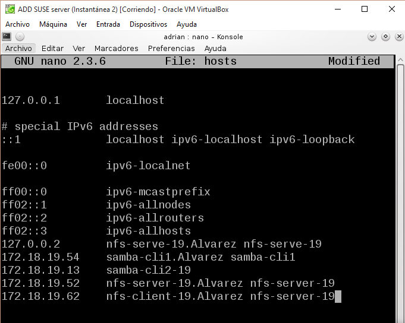
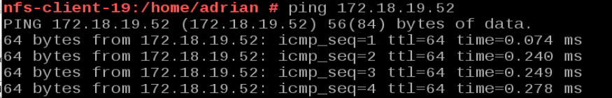

Gregorio Adrian Quintero Alvarez

#NFS (Network File System)

NFS es una forma de crear recursos en red para compartir con sistemas heterogéneos.

## 1. SO Windows

Para la parte de windows vamos a necesitar 2 máquinas:

Una máquina virtual de  Windows 2008 Server como servidor NFS.

- Como nombre de la máquina usaremos nuestro primer apellido+19+WS", le pondremos una IP estática 172.18.19.22  y como grupo de trabajo AULA108.

    

Una máquina virtual de Windows 7 (Enterprise) como cliente NFS.
       
- Como nombre de la máquina usaremos nuestro primer apellido+19+WC", le pondremos una IP estática 172.18.19.12  y como grupo de trabajo AULA108.

## 1.1 Servidor NFS Windows

Empezaremos con la Instalación del servicio NFS en Windows 2008 Server

- Iremos a la parte de agregar rol Servidor de Archivos y marcamos Servicio para NFS.

Ahora configuraremos el servidor NFS de la siguiente forma:

A continuacion crearemos la carpeta c:\export\public y  la configuramos para 
que sea accesible desde la red en modo lectura/escritura con NFS.

Después crearemos la carpeta c:\export\private y la configuramos para quea 
accesible desde la red sólo en modo sólo lectura.

Para comporbar  los recursos compartidos usamos el comando showmount -e 172.18.19.22.

## 1.2 Cliente NFS

Vamos a instalar el soporte cliente NFS bajo Windows 7

En primer lugar vamos a instalar el componente cliente NFS para Windows. Para ello vamos a Panel de Control -> Programas -> 
Activar o desactivar características de Windows.

- Nos desplazamos por el menú hasta localizar Servicios para NFS y dentro de
este, Cliente NFS, elegimos ambos y le damos a Aceptar y en unos instantes 
tendremos el soporte habilitado.

Para iniciar el servicio NFS en el cliente, abrimos una consola con permisos de Administrador y ejecutamos el siguiente comando: 

- nfsadmin client start

## 1.3 Montando el recurso

Ahora necesitamos montar el recurso remoto para poder trabajar con él, para 
ello es necesario seguir unos pasos, esto no lo hacemos con Administrador,
 sino con nuestro usuario normal.

- Consultar desde el cliente los recursos que ofrece el servidor: showmount -e 172.18.19.22

- Montaremos el recurso remoto con: mount –o anon,nolock,r,casesensitive \\172.18.19.22\Nombre-recurso-NFS *

- Public

- Private

- Comprobaremos en el cliente los recursos montados: net use.

- Comprobaremos desde el cliente: showmount -a 172.18.19.22.

- En el servidor ejecutamos el comando showmount -e 172.18.19.22, para ver los recursos compartidos.

Si tenemos problemas comprobaremos el cortafuegos del servidora ver si permite accesos NFS.

- Para desmontar la unidad simplemente escribimos en una consola: umount z:

- En el servidor ejecutamos el comando showmount -e 172.18.19.22, para comprobar los recursos compartidos.

# 2 OpenSUSE

Vamos a necesitar 2 máquinas GNU/Linux:

Una máquina de OpenSUSE, donde instalamos el servicio NFS 

- Como nombre de esta máquina usar nfs-server-19. Modificaremos el fichero /etc/hostname y el fichero /etc/hosts, usaremos una IP estática 172.18.19.52
y el VirtualBox Red en Modo Puente

Una máquina de OpenSUSE, donde instalaremos el cliente NFS.
        
- Como nombre de esta máquina usar nfs-client-19, usaremos una IP estática 172.18.19.62 y pondremos el VirtualBox Red en Modo Puente

/ETC/HOSTS: Por comodidad podemos configurar el fichero /etc/hosts del cliente y servidor, añadiendo estas líneas:

-   172.18.XX.52 nfs-server-19.alvarez   nfs-server-19
-   172.18.XX.62 nfs-client-19.alvarez   nfs-client-19

- Servidor

- Cliente

2.1 Servidor NFS

Para instalar servidor NFS usaremos el entorno grafico de OpenSUSE denominado Yast.

Crearemos las siguientes carpetas y le asignaremos unos permisos:

- /var/export/public, usuario y grupo propietario nobody:nogroup

- /var/export/private, usuario y grupo propietario nobody:nogroup, permisos 770
  

Ahora vamos a configurar el servidor NFS de la siguiente forma:

- La carpeta /var/export/public, será accesible en modo lectura/escritura.
        
- La carpeta /var/export/private, sea accesible sólo en modo lectura.
    
Para ello usaremos el Yast o modificamos el fichero /etc/exports añadiendo las siguientes líneas:

Para iniciar y parar el servicio NFS, usaremos Yast o systemctl. Si al iniciar el servicio aparecen mensaje de error 
o advertencias, debemos resolverlas.

Para comprobarlo, showmount -e localhost. Muestra la lista de recursos exportados por el servidor NFS.

## 2.2 Cliente NFS

En esta parte, vamos a comprobar que las carpetas del servidor son accesibles 
desde el cliente. Normalmente el software cliente NFS ya viene preinstalado 
pero si tuviéramos que instalarlo en OpenSUSE zypper in nfs-common.

Antes de realizar la comprobacion de conectividad nos vamos al Servidor y modificamos
el contafuegos.

Comprobar conectividad desde cliente al servidor:

- ping 172.18.19.22: Comprobar la conectividad del cliente con el servidor. Si falla hay que revisar las configuraciones de red.

- nmap 172.18.19.22 -Pn: nmap sirve para escanear equipos remotos, y averiguar que servicios están ofreciendo al exterior.

- showmount -e 172.18.19.22: Muestra la lista de recursos exportados por el servidor NFS.

En el cliente vamos a montar y usar cada recurso compartido.

Creamos la carpeta /mnt/remoto/public y con el comando mount.nfs 172.18.19.22:/var/export/public /mnt/remoto/public montamos el recurso.

Ahora usando df -hT veremos que los recursos remotos están montados en nuestras carpetas locales.

Para montar los recursos NFS del servidor Windows haremos mount.nfs 172.18.19.22:/C/export/public /mnt/remoto/windows. Ahora podemos crear carpetas o 
ficheros dentro del recurso public, pero sólo podremos leer lo que aparezca en private.

2.3. Montaje automático

Para configurar acciones de montaje autoḿaticos cada vez que se inicie el equipo en OpenSUSE usamos Yast o bien modificamos la configuración del fichero /etc/fstab. Comprobarlo.

Incluir contenido del fichero /etc/fstab en la entrega.

