Gregorio Adrián Quintero Álvarez

#Servidor LDAP - OpenSUSE

## 1.1 Preparar la máquina

Comenzamos la instalación del servidor LDAP para ello vamos a usar una MV para montar nuestro servidor LDAP con un sistema operativo OpenSUSE 13.2
con una IP estática la cual será 172.18.19.51, y el nombre de equipo "ldap-server-19" y de dominio "curso1516"

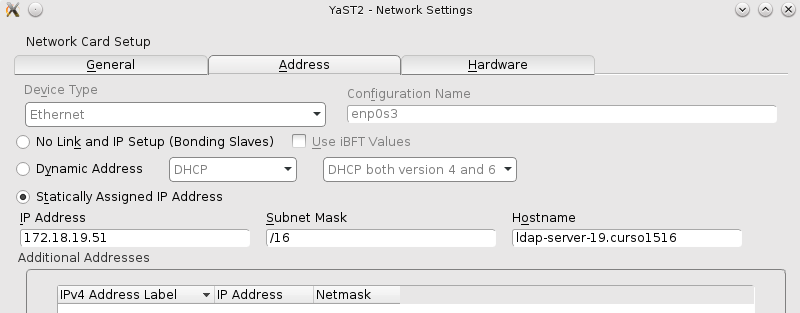

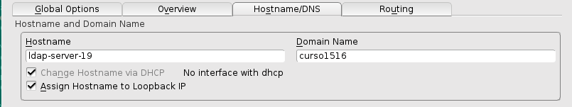

Después en el archivo /etc/hosts añadiremos

- 127.0.0.2   ldap-server-19.curso1516   ldap-server-19
- 127.0.0.3   adrian19.curso1516  adrian19

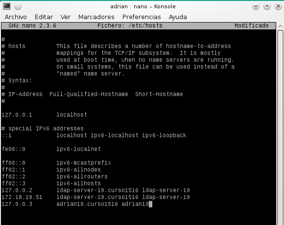

Por último realizaremos los siguientes comandos: ip a, hostname -f, lsblk, blkid

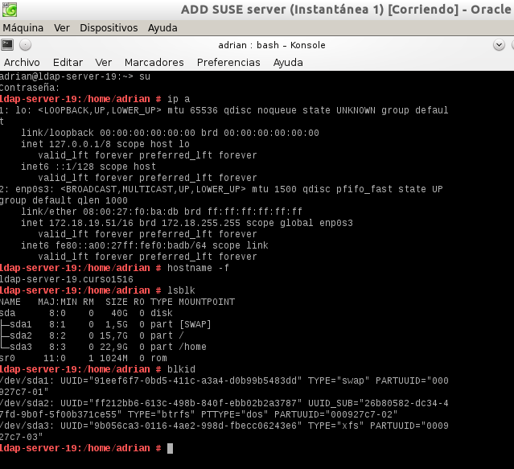

##1.2 Instalación del Servidor LDAP

Procedemos a la instalación del módulo Yast para gestionar el servidor LDAP (yast2-auth-server) y apartir de aquí seguimos los pasos indicados en servidor LDAP de la siguiente forma:

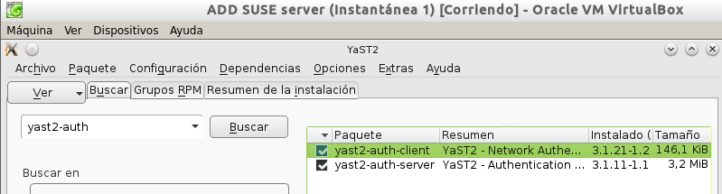

Iremos a yast y buscaremos el Servidor de autenticación. y seleccionamos estas opciones:

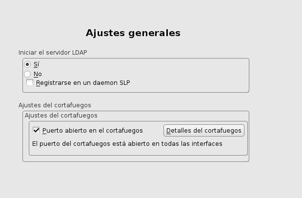

- Elegimos como tipo de servidor: autónomo

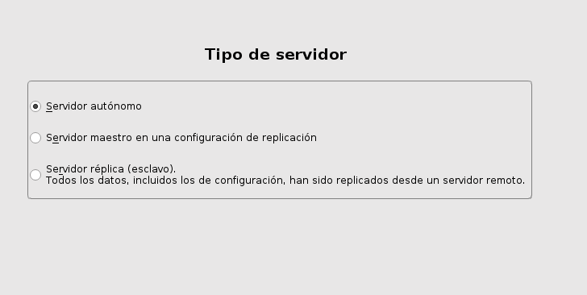

- En la configuración TLS la dejamos en NO habilitar

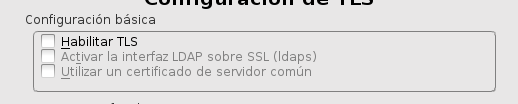

- Usamos como DN lo siguiente: dc=adrian19, dc=curso1516.
- Como contraseña se estableció "alumno"

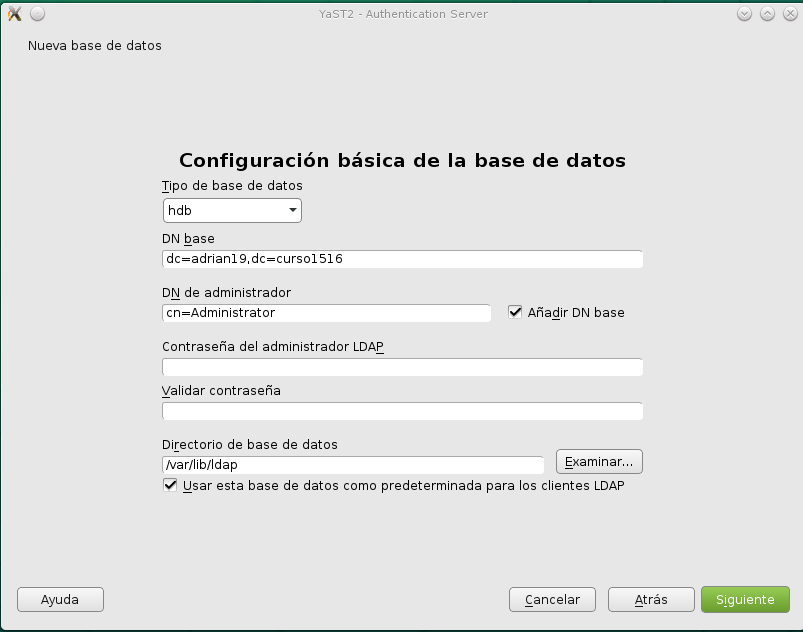

- NO habilitamos kerberos.

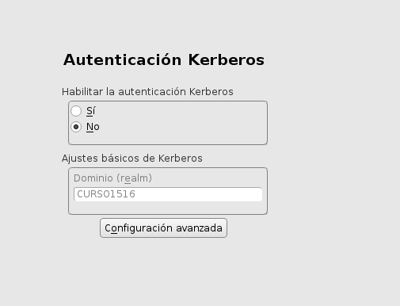

Una vez instalado, comprobamos el servicio con el comando "systemctl status slapd" y miramos que el servicio se inicia automáticamente al reiniciar la máquina.

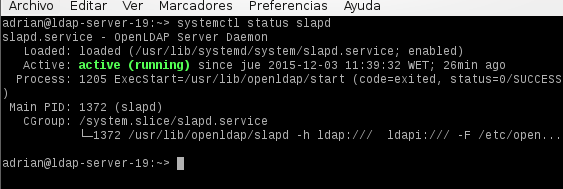

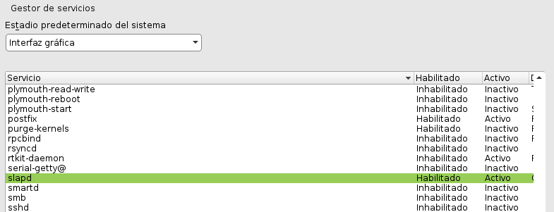

Continuamos instalando el GQ mediante comando y despues comprobar el contenido de la base de datos LDAP usando la herramienta gq.

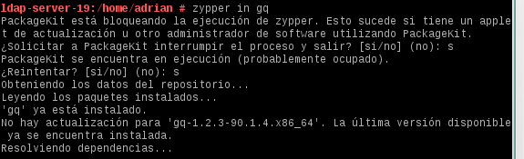

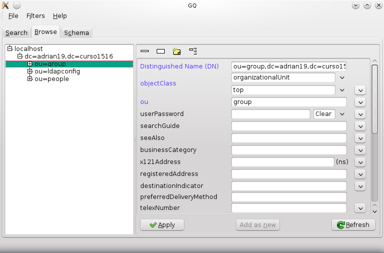

## 1.3. Crear usuarios y grupos en LDAP

Ahora vamos a introducir datos de usuarios y grupos en el servidor LDAP personalizando la información de la siguiente forma:

Debemos instalar el paquete yast2-auth-client, que nos ayudará a configurar la máquina para autenticación. En Yast aparecerá como Authentication Client.

El parámetro LDAP URI es un localizador del recurso de la base de datos LDAP -> ldap://dc=adrian19,dc=curso1516

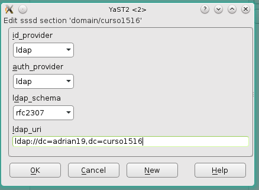

Las unidades organizativas: groups y people. Han sido creadas automáticamente por Yast en el paso anterior.

Crear los grupos jedis2 y siths2 (Estos se crearán dentro de la ou=groups).

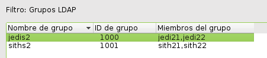

Crear los usuarios jedi21, jedi22, sith21, sith22 (Estos se crearán dentro de la ou=people).

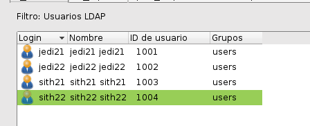

Ahora comprobamos que los usuarios creados anteriormente estan dentro de los grupos que se encuentran el el GQ.

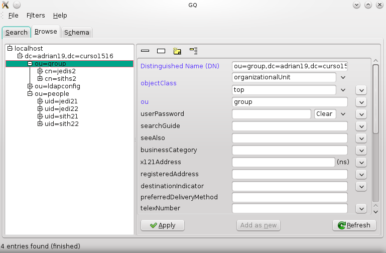

Despues con el comando ldapsearch -x -L -u -t "(uid=nombre-del-usuario)" se puede consultar la base de datos de LDAP y ver la información de los
usuarios e aquí un ejemple:

 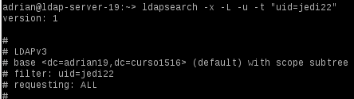

## 1.4 Autentificación

Desde el servidor LDAP vamos a comprobar el acceso con los usuarios definidos en LDAP.

A continuación usamos los siguientes comandos para ver la información en el sistema.
(hostname -f, ip a, date, cat /etc/passwd | grep "Nombre del usuario", finger "Nombre del usuario", id "Nombre del usuario", su "Nombre del usuario" )

 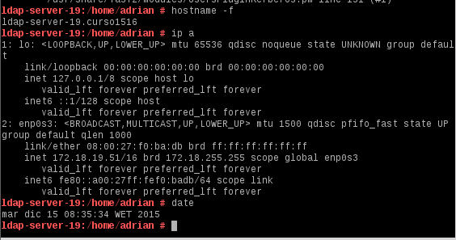

 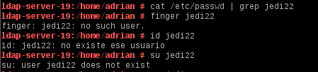

# 2 Otro equipo

## 2.1 Preparativo

Al otro equipo le estableceremos una IP estatica la cual será 172.18.19.52, como nombre del equipo usaremos "ldap-slave-19" y de dominio "curso1516".
Después iremos al archivo /etc/hosts añadiendole los datos del servidor ldap para realizar la conexión.

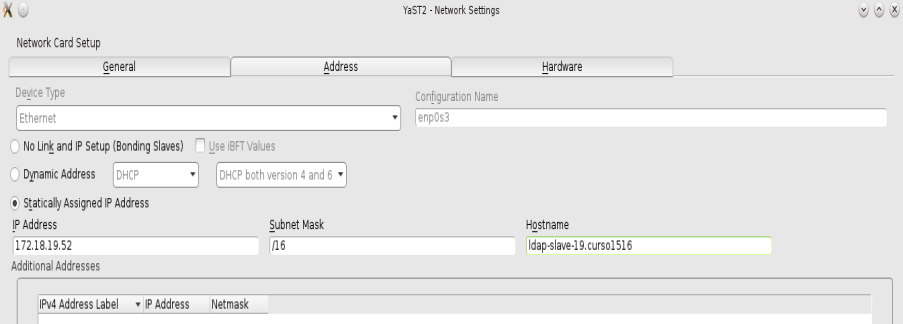

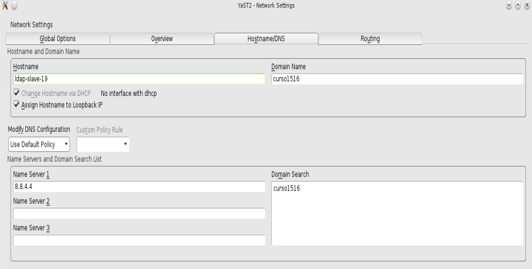

Por ultimo realizaremos los siguientes comandos: ip a, hostname -f, lsblk, blkid

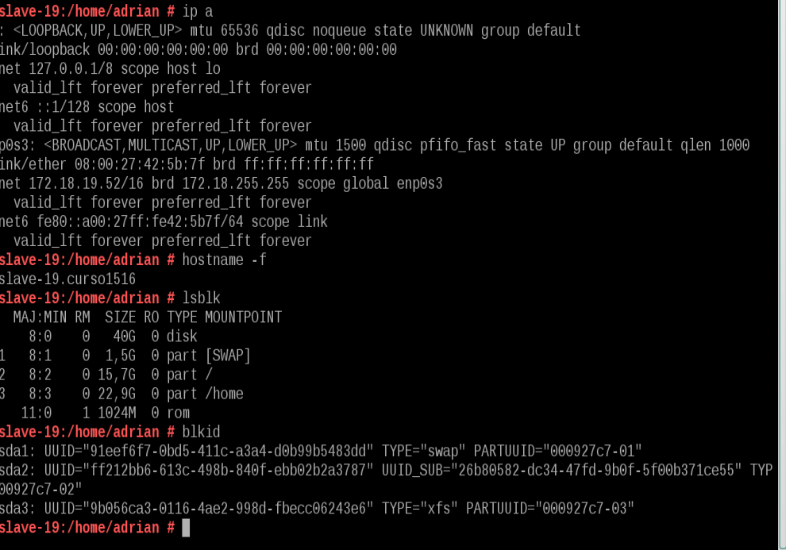

## 2.2 Configuración

Siguiendo las instrucciones vamos a crear el grupo LDAP troopers y dentro de este trooper1 y trooper2 y despues con el gq comprobamos los datos del servidor LDAP
