Gregorio Adrián Quintero Álvarez

## Tareas Programadas

## 1.SO OpenSUSE

# 1.1 Configuración de la máquina.

Para esta práctica usaremos una máquina virtual de openSUSE 13.2 en la cual estableceremos
esta serie de parametros:

- Una IP estática: 172.18.19.51.
- Como máscara de red: 255.255.0.0.
- Gateway: 172.18.0.1.
- Servidor DNS: 8.8.4.4
- Como nombre del equipo: Quintero3
- Como nombre del dominio: Alvarez
- La tarjeta de red deberá de estar en modo puente.

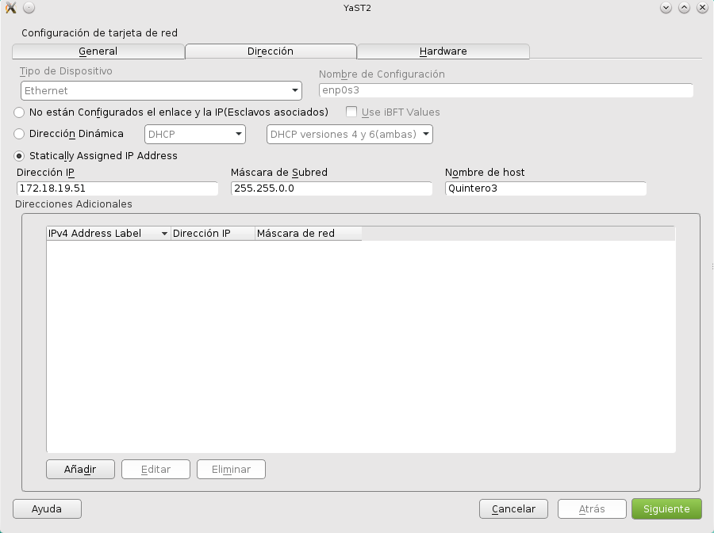 

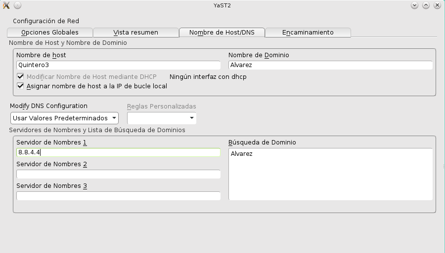 

Además también deberemos de instalar el openssh para que el profesor pueda acceder 
de forma remota.

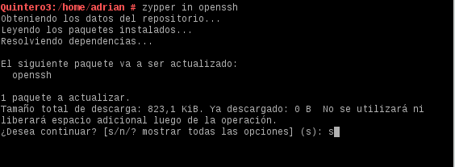

También deberemos comprobar que el /etc/hosts se encuentra configurado de forma correcta 

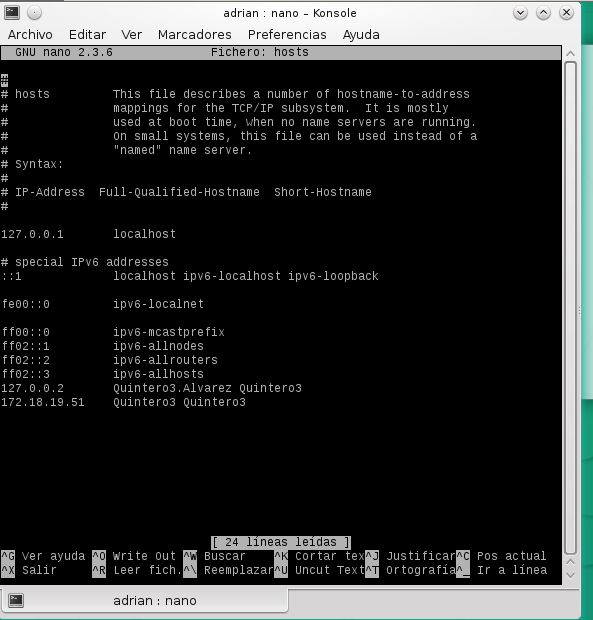

y a continuación vamos a realizar una comprobación con los siguientes comandos:

- uname -a
- hostname -a
- hostname -d
- ip a 
- route -n
- blkid

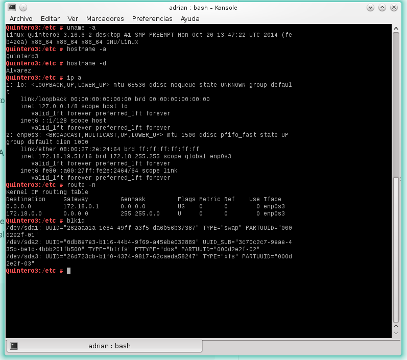

# 1.2 Tarea diferida.

En esta tarea vamos a utilizar el comando "at" que nos permitirá realizar un 
apagado de la máquina, para que el comando funcione correctamente lo primero
que deberemos realizar será la activación del servicio "atd".

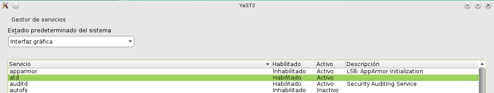

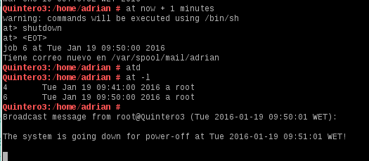

# 1.3 Tarea periódica

Vamos a progamar una tarea periódica en las cual se nos muestre un mensaje de animo para ello   
usaremos un script.

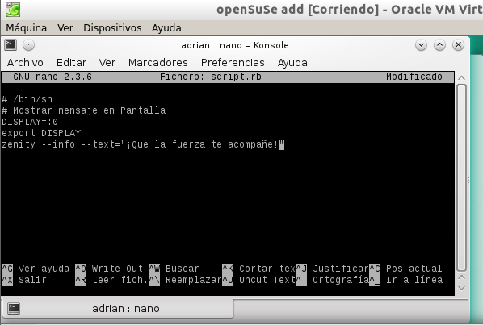

## 2 S.O. Windows 7

# 2.1 Configuración de la máquina.

Para esta parte de la práctica usaremos un Windows 7 Professional con esta configuración:

- IP estática: 172.18.19.11
- Nombre del equipo: Quintero1
- Máscara de red: 255.255.0.0
- Gateway: 172.18.0.1
- Servidor DNS: 8.8.4.4
- Grupo de trabajo: AULA108
- Tarjeta de red en adaptador puente.

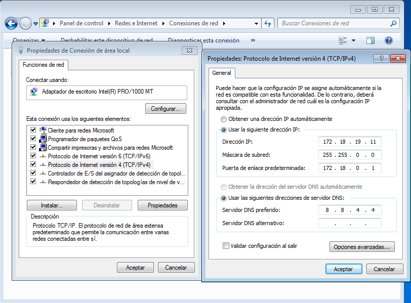

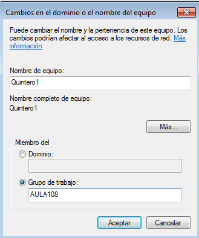

# 2.2 Tarea Diferida.

Empezaremos progamando un tarea que nos muestre un mensaje anonimo en la pantalla,
para ello iremos al panel de control -> Herramientas Administrativas -> Programador de tareas 
y alli preparamos la tarea de mensaje.

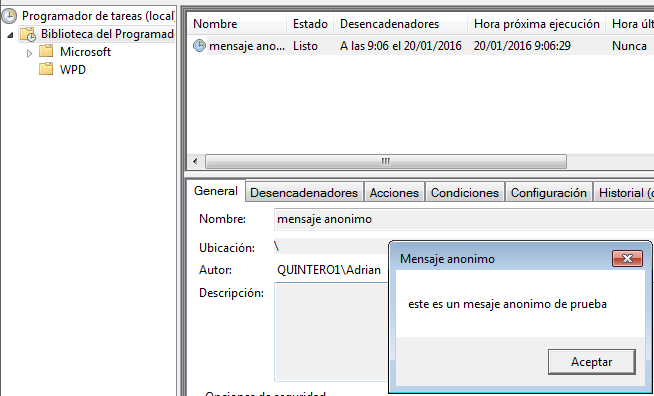

# 2.3 Tarea periódica.

Ahora programaremos una tarea que nos apague la máquina para ello usaremos un comando.
shutdown /s /t "aqui pondremos el tiempo en segundos". Ejemplo: shutdown /s /t 60.
Esto programara un apagado para dentro de 60seg.

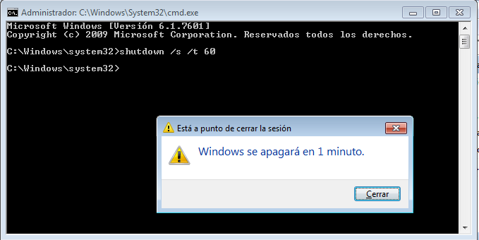

# 2.4 Tarea asíncrona.

A continuación vamos a programar una tarea que realice una copia de backup con
comandos de tipo xcopy para copiar los documentos del usuario en una zona de backup.

Para ello nos vamos al programador de tareas y creamos una tarea nueva y la ejecutamos con los privilegios mas altos, 
ahora entramos en la acciones del programador para seleccionar un programa o script.

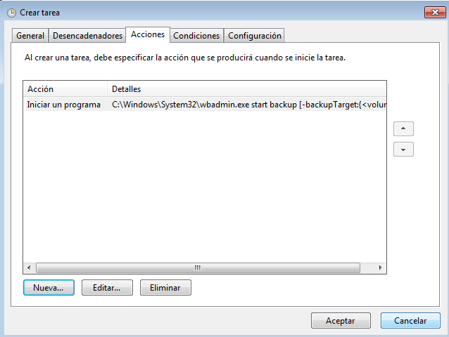

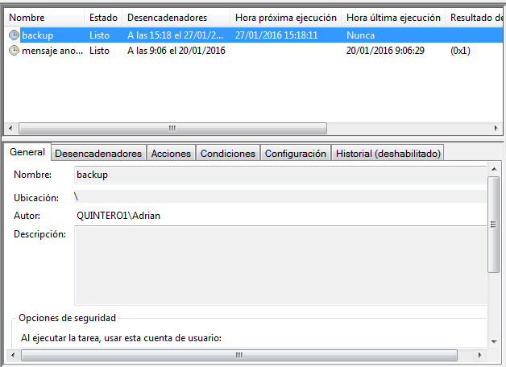

