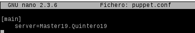
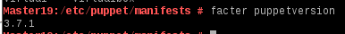

Gregorio Adrian Quintero Alvarez

# 1.Introducción.

En esta práctica vamos a realizar una conexión de un Master que tendrá un S.O 
de OpenSUSE y de dos clientes, uno Linux y otro Windows. Esto se realizará mediante
Puppet una herramienta diseñada para administrar la configuración de sisteras Unix-like y de Microsoft.

## 1.1 Configuración.

### Mv1 -> Master.

Esta máquina tendrá la siguiente configuración: 

 -  Sistema Operativo GNU/Linux OpenSUSE 13.2.
 -  Una  IP estática 172.18.19.100.
 -  Enlace: 172.18.0.1.
 -  DNS: 8.8.4.4.
 -  Nombre del equipo: master19.
 -  Dominio = Quintero19.
 -  Instalar OpenSSH-Server para acceso del profesor.

 

 

### Mv2 -> Cliente1 

Esta máquina recibirá ordenes del master y tendrá esta configuración:

 -  Sistema Operativo GNU/Linux OpenSUSE 13.2.
 -  Una IP estática 172.18.19.101.
 -  Enlace: 172.18.0.1.
 -  DNS: 8.8.4.4.
 -  Nombre del equipo: cli1alu19.
 -  Dominio = Quintero19.
 -  Instalar OpenSSH-Server para acceso del profesor.

### Mv3 -> Cliente2

Esta máquina también recibirá ordenes del master y tendrá la siguiente configuración:

 -  SIstema Operativo Windows 7.
 -  Una IP estática 172.18.19.102
 -  Enlace: 172.18.0.1
 -  DNS: 8.8.4.4.
 -  Nombre Netbios: cli2alu19.
 -  Nombre del equipo: cli2alu19.
 -  Grupo de trabajo = AULA108.
 -  Instalar ServidorSSH para acceso del profesor.

Cada MV deberá tener configurado su fichero "/etc/hosts" para poder hacer ping
usando los nombres de las máquinas.

 #### Master

 #### Cliente1

 #### Cliente2

## 1.2 Comprobación de las cofiguraciones.

Para realizar la comprobación en las máquinas de OpenSUSE usaremos estos comandos:

 -  date
 -  ip a
 -  route -n
 -  host www.google.es
 -  hostname -a
 -  hostname -f
 -  hostname -d

#### Master

#### Cliente1

 -  ping master19
 -  ping master19.Quintero19

 -  ping cli1alu19
 -  ping cli1alu19.Quintero19

 -  ping cli2alu19

  
Para realizar la comprobación en la máquina de Windows usaremos estos comandos

 -  date
 -  ipconfig
 -  route /PRINT

 -  nslookup www.google.es

 -  ping master19
 -  ping master19.Quintero19
 -  ping cli1alu19
 -  ping cli1alu19.Quintero19
 -  ping cli2alu19

#IMPORTANTE

Deberemos comprobar que todas las máquinas tienen la fecha y hora correcta.

## 2. Primera versión del fichero pp.

Instalamos en el Master el PuppetMaster con este comando:

 - zypper install puppet-server puppet puppet-vim.

Consultamos el estado del servicio:

 - Systemctl status puppetmaster

Permitimos que el servicio se inicie de forma automática en el inicio de la máquina.

 - Systemctl enable puppetmaster

Ahora iniciamos el servicio y volvemos a comprobar el estado.

 - Systemctl start puppetmaster

 - Systemctl status puppetmaster

Después creamos los Ficheros//Directorios en el  Master:

 -  mkdir /etc/puppet/files
 -  mkdir /etc/puppet/manifests
 -  mkdir /etc/puppet/manifests/classes
 -  touch /etc/puppet/files/readme.txt
 -  touch /etc/puppet/manifests/site.pp
 -  touch /etc/puppet/manifests/classes/hostlinux1.pp

## 2.1 /etc/puppet/files/readme.txt.

En el interior del readme estableceremos este texto:

"¡Qué la fuerza te acompañe!."

Los ficheros que se guarden dentro del /etc/puppet/files se pueden descargar por
el resto de máquinas puppet.

## 2.2 /etc/puppet/manifests/site.pp

"/etc/puppet/manifests/site.pp" es el fichero principal de configuración de 
órdenes para los agentes/nodos puppet.

En el interior de este fichero estableceremos este contenido:

## 2.3 /etc/puppet/manifests/classes/hostlinux1.pp

Como es posible tener muchas configuraciones, se van a separar en distintos 
ficheros para organizarnos mejor y las guardaremos en /etc/puppet/manifests/classes.

Vamos a crear la primera configuración, la cual se llamará hostlinux1.pp y que tendrá
este contenido:

Ahora comprobaremos que tenemos los permisos adecuados en la ruta /var/lib/puppet.

Reiniciamos el servicio con el comando: "systemctl restart puppetmaster".

Después comprobamos que el servicio está en ejecución de forma correcta con:
 
 -   systemctl status puppetmaster

 -   netstat -ntap

A continuación consultamos los  log por si hay errores: tail /var/log/puppet/*.log

3. Instalación y Configuración 

Ahora en la máquina cliente1 instalamos el Agente Puppet mediante comando.

 - zypper in puppet.

El cliente puppet debe ser informado de quien será su master. Para ello, añadimos a /etc/puppet/puppet.conf:

    [main]
    server=Master19.Quintero19

 -  Comprobamos que tenemos los permisos adecuados en la ruta /var/lib/puppet.

 -  Vemos el estado del servicio puppet.

      systemctl status puppet	

 -  Activamos el servicio en cada reinicio de la máquina.

      systemctl enable puppet

 -  Iniciamos el servicio puppet.

      systemctl start puppet

 -  Vemos el estado del servicio puppet.

      systemctl status puppet

 -  Muestra los servicios conectados a cada puerto.

      netstat -ntap

 -  Comprobamos los log del cliente: tail /var/log/puppet/puppet.log

## 4. Certificados

### 4.1 Aceptar certificados.

Vamos al master y consultamos las peticiones pendientes de union al master: puppet cert list.

Aceptamos al nuevo cliente desde el master con: "puppet cert sign "cli1alu19.Quintero19"".

### 4.2 Comprobación Final

Nos vamos al cliente1 y reinicimos el servicio puppet.

Comprobamos que los cambios configurados en puppet se han realizado.

Para ver en detalle los errores, podemos reiniciar el servicio puppet en el cliente y consultar el archivo log del cliente.

Puede ser que tengamos en algún mensaje de error de configuración del fichero /etc/puppet/manifests/site.pp
del master, si es asi ir al master y corregir los errores y continuar con el siguiente paso.

## 5 Segunda versión del fichero pp

A continuación probaremos una configuración mas compleja del puppetmaster.

Esto irá en otro fichero pp que se llamara hostlinux2.pp, el cual tendrá este contenido:

También deberemos configurar el fichero site.pp para añadir el hostlinux2.pp

## 6. Cliente puppet Windows

Ahora vamos a configurar puppet para atender también a clientes de Windows

### 6.1 Modificaciones en el Master 

En el master vamos a crear una configuración puppet para las máquinas windows,
dentro del fichero etc/puppet/manifests/classes/hostwindows3.pp, con el siguiente contenido:

Ahora vamos a modificar el fichero site.pp del master, para que tenga en cuenta
la configuración de clientes GNU/Linux y clientes Windows, de la siguiente forma:

Después reiniciamos el servicio PuppetMaster y comprobamos que versión tenemos 
instalada con el comando "Facter" puesto que en la máquina Windows hace falta tener
instalada la misma versión que el master.

### 6.2 Modificaciones en el Cliente2

Vamos a instalar el AgentePuppet en windows, despues de haberla instalado reinicimos la
máquina y aceptamos el certificado en el master para este nuevo cliente.

Ahora aceptamos el certificado en el master

Iniciamos el puppet como administrador y probamos los siguientes comandos:

 -  puppet agent --configprint server, debe mostrar el nombre del servidor puppet. En nuestro ejemplo debe ser Master19.Quintero19.
 -  puppet agent --server Master19.Quintero19 --test: Comprobar el estado del agente puppet.

 

-  puppet agent -t --debug --verbose: Comprobar el estado del agente puppet.
 -  facter: Para consultar datos de la máquina windows

 -  puppet resource user Adrian: Para ver la configuración puppet del usuario.

 -  puppet resource file c:\Users: Para var la configuración puppet de la carpeta.

Ahora vamos a la configuración del master y creamos el fichero "hostwindows3.pp" en
la ruta "/etc/puppet/manifests/classes" con este contenido:

class hostwindows3 {
  user { 'darth-sidius':
    ensure => 'present',
    groups => ['Administradores']
  }

  user { 'darth-maul':
    ensure => 'present',
    groups => ['Usuarios']
  }
}

Tambien debemos añadir el en el site.pp el hostwindows3.pp

