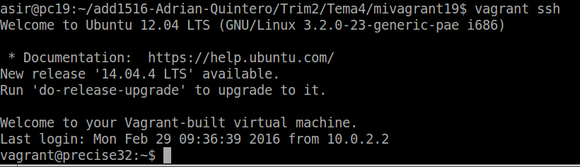
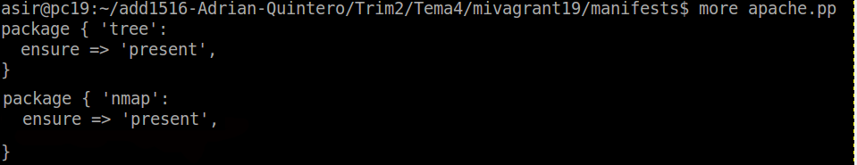

## Gregorio Adrián Quintero Álvarez

#1. Primeros pasos

##1.1 Instalar

Para instalar vagrant hay varias formas.

* Nosotros vamos a usar el paquete [Vagrant-deb] preparado para descargar del servidor Leela.

##1.2. Proyecto

* Crear un directorio para nuestro proyecto vagrant con esta serie de comandos:

    mkdir mivagrantXX
    cd mivagrantXX
    vagrant init


##1.3 Imagen, caja o box

Ahora necesitamos obtener una imagen de un sistema operativo. Por ejemplo:

	- Vagrant box add micajaXX_ubuntu_precise32 http://files.vagrantup.com/precise32.box


 	- Podemos listar las cajas/imágenes disponibles actualmente en nuestro sistema con `vagrant box list`.
	- Para usar una caja determinada en nuestro proyecto, modificamos el fichero `Vagrantfile` 
de la carpeta del proyecto.
	- Cambiamos la línea `config.vm.box = "base"` por  `config.vm.box = "micajaXX_ubuntu_precise32"`.


##1.4 Iniciar la máquina

Vamos a iniciar la máquina virtual creada con Vagrant:

* `cd mivagrant19`
* `vagrant up`: comando para iniciar una la instancia de la máquina.


Podemos usar ssh para conectar con nuestra máquina virtual (`vagrant ssh`).



 Otros comandos de Vagrant:

 vagrant suspend: Suspender la máquina.
    

    
vagrant resume: Volver a despertar la máquina.
    

    
vagrant halt: Apagarla la máquina.
    
vagrant status: Estado actual de la máquina.
    

    
vagrant destroy: Para eliminar completamente la máquina.
   

    

#2. Configuración

##2.1 Carpetas sincronizadas

 La carpeta del proyecto que contiene el `Vagrantfile` comparte los 
 archivos entre el sistema anfitrión y el virtualizado, esto nos permite 
 compartir archivos fácilmente entre los ambientes.

* Para identificar la carpeta compartida dentro del ambiente virtual,
lo que hacemos es:

    vagrant up
    
    vagrant ssh
    
    ls /vagrant
    


##2.2 Redireccionamiento de los puertos

Uno de los casos más comunes cuando tenemos una máquina virtual es la 
situación que estamos trabajando con proyectos enfocados a la web, 
y para acceder a las páginas no es lo más cómodo tener que meternos 
por terminal al ambiente virtual y llamarlas desde ahí, aquí entra en 
juego el enrutamiento de puertos.

* Modificar el fichero `Vagrantfile`, de modo que el puerto 4567 del 
sistema anfitrión será enrutado al puerto 80 del ambiente virtualizado.

`config.vm.network :forwarded_port, host: 4567, guest: 80`


* Luego iniciamos la MV (si se encuentra en ejecución la reiniciamos con `vagrant reload`)

#3.Suministro

##3.1 Suministro mediante script

Quizás el aspecto con mayor beneficios del enfoque que usa Vagrant 
es el uso de herramientas de suministro, el cual consiste en correr 
una receta o una serie de scripts durante el proceso de levantamiento 
del ambiente virtual que permite instalar y configurar un sin fin 
piezas de software, esto con el fin de que el ambiente previamente 
configurado y con todas las herramientas necesarias una vez haya sido levantado.

Por ahora suministremos al ambiente virtual con un pequeño script que 
instale Apache.

* Crear el script `install_apache.sh`, dentro del proyecto con el siguiente
contenido:

```
    #!/usr/bin/env bash

    apt-get update
    apt-get install -y apache2
    rm -rf /var/www
    ln -fs /vagrant /var/www
    echo "<h1>Actividad de Vagrant</h1>" > /var/www/index.html
    echo "<p>Curso201516</p>" >> /var/www/index.html
    echo "<p>Nombre-del-alumno</p>" >> /var/www/index.html
```


Modificar Vagrantfile y agregar la siguiente línea a la configuración:
`config.vm.provision :shell, :path => "install_apache.sh"`


* Iniciamos la MV o `vagrant reload` si está en ejecución para que coja el cambio de la configuración.

> Podremos notar, al iniciar la máquina, que en los mensajes de salida se muestran
mensajes que indican cómo se va instalando el paquete de Apache que indicamos:

* Para verificar que efectivamente el servidor Apache ha sido instalado e iniciado, 
abrimos navegador en la máquina real con URL `http://172.18.19.0:4567`.


##3.2 Suministro mediante Puppet

Vagrantfile configurado con puppet:


Fichero de configuración de puppet:



Posteriormente veremos que el proceso de instalación estan los nuevos programas


* En el fichero `apache2.pp`, estarán las órdenes puppet para instalar y configurar 
el servicio web apache2.

#4. Otras cajas, nuestras cajas

Si estamos pensando en crear nuestra propia caja, entonces podemos seguir las
indicaciones del siguiente enlace:
* [¿Cómo crear una Base Box en Vagrant a partir de una máquina virtual?](http://www.dbigcloud.com/virtualizacion/146-como-crear-un-vase-box-en-vagrant-a-partir-de-una-maquina-virtual.html)

Siguiendo el enlace anterior, creamos el usuario Vagrant, para poder acceder a la máquina virtual por ssh.


Aunque Vagrant no esta pensado para usar el usuario root, cambiaremos la password de root a vagrant.


Concedemos permisos al usuario vagrant.


A partir de una máquina virtual VirtualBox (`openSuSe_add_vagrant`) vamos a crear la caja `package.box`.


 - Comprobamos que se ha creado la caja `package.box` en el directorio donde
hemos ejecutado el comando. 

 - Muestro la lista de cajas disponibles, pero sólo tengo 1 porque todavía
no he incluido la que acabo de crear.


Realizamos una comprobación para ver que el se ha añadido la nueva máquina.


Cuando intentamos inicial la máquina al final nos muestra un mensaje de error que no nos permite iniciarla


#ANEXO

¿Dónde se guardan las imágenes base? ¿Las cajas de vagrant que nos vamos descargando?


